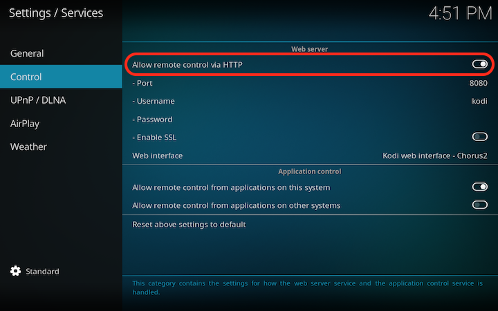
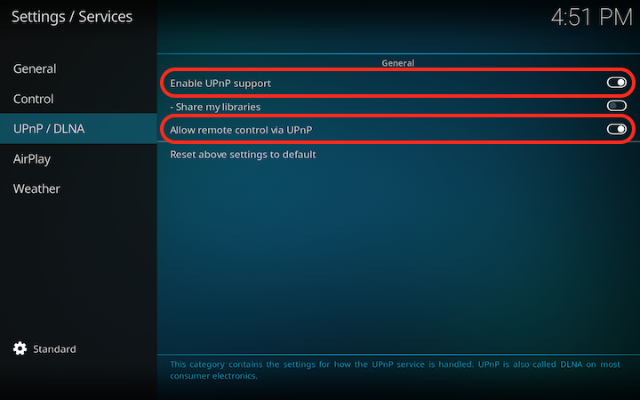

Handover – Kodi Addon
=========================
Cast currently playing item to another Kodi instance.

Functionality overview
-------------------------
1. Gets currently playing file/url and playback time from Kodi player
2. Performs discovery of other Kodi devices on network via SSDP (UPnP)
3. Displays a popup with available devices
4. Sends a request to play the file on selected device via JSON-RPC

To be able to easily invoke the addon during playback, map it to a key or use [Commands](https://kodi.wiki/view/Add-on:Commands).

Note that when playing a local file, both source and target device need to have access to the file with media sources configured in the same way. In this case, consider using the native "Play with" UPnP feature instead. See https://kodi.wiki/view/UPnP#Stream_to_Clients.

Typical usage
-------------------------
With a home setup involving multiple Kodi devices, you can cast currently playing file to another device and continue watching/listening in another room.

Addon settings
-------------------------
+ Choose whether or not should the media start playing from the beggining (default: off)
+ Playback start offset - you might want to shift the playback time back a little, since it usually takes a few seconds for Kodi to process the media (default: 5 seconds)

Requirements
-------------------------
On the target devices, the following needs to be enabled:
+ Settings > Services > Control > **Allow remote control via HTTP**
+ Settings > Services > UPnP/DLNA > **Enable UPnP support**
+ Settings > Services > UPnP/DLNA > **Allow remote control via UPnP**

TODO
-------------------------
+ Ability to add custom target devices in addon settings
